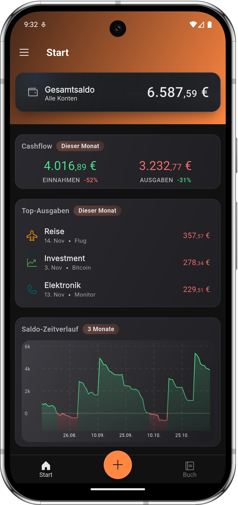

# MoneyKoi

MoneyKoi is a modern personal finance app built with a focus on clarity, speed, and a fully offline-first architecture.
It is designed to help users organize expenses, track habits, and maintain full control over their data — even without an internet connection.

This repository acts as the root workspace and links together all modules of the MoneyKoi ecosystem.

## 📸 Screenshot

A preview of the MoneyKoi app:



## 🧩 Project Structure & Submodules

MoneyKoi is split into several repositories to keep the system modular, scalable, and easy to maintain.

### 1. App (Flutter)
**Repo:** https://github.com/GeraldGmainer/moneykoi-app  
The main MoneyKoi mobile application built with Flutter, featuring:
- Offline-first architecture with local caching and background sync
- Supabase integration (auth, database, storage, edge functions)
- Clean architectural layers (domain → DTO → local/remote data sources)
- Modern UI with polished animations and consistent design system
- Multi-language support via Easy Localization
- Advanced charting, category management, recurring transactions, and multi-account support

### 2. Web Interface
**Repo:** https://github.com/GeraldGmainer/moneykoi-web  
Currently an empty scaffold. Intended for future:
- Web dashboard
- Account settings
- Desktop-friendly budgeting tools

### 3. Supabase Backend
**Repo:** https://github.com/GeraldGmainer/moneykoi-supabase  
Contains all backend-related logic:
- PostgreSQL schema and migrations
- RLS (Row-Level Security)
- Policies for user data isolation
- Edge functions for synchronization and business logic
- Storage buckets for assets
- Seed data and utilities

### 4. Test Data Tools
**Repo:** https://github.com/GeraldGmainer/moneykoi-testdata  
A small web interface used to generate realistic test data for development:
- Fake transaction sets
- Category templates
- Multi-month budgeting data

### 5. Assets
**Repo:** https://github.com/GeraldGmainer/moneykoi-assets  
Shared assets used across the ecosystem:
- Icons (custom Koi set, categories, UI icons)
- Images and illustrations
- Design files
- Brand colors, typography, and layout guidelines

## 🚀 Getting Started

To clone this repository along with all submodules:

```bash
git clone --recurse-submodules git@github.com:GeraldGmainer/moneykoi.git
```

If you already cloned it without submodules, initialize them using:
```bash
git submodule update --init --recursive
```

## 📄 License

This project is proprietary and not open source.  
All rights reserved — you may not copy, distribute, or reuse any part of this code or design without explicit permission.